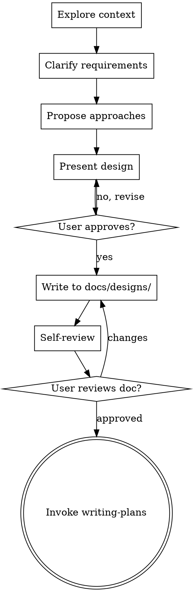

# Design Documentation Workflow

## Overview

Structured workflow for creating technical design documents that bridge high-level architecture and implementation. Ensures designs are validated before coding begins.

## When to Use

- Breaking down multi-phase projects into implementable designs
- Transforming architecture specs into concrete technical plans
- Need to validate approach before committing to implementation
- Working with configuration-driven or modular architectures

## Workflow



## Core Steps

### 1. Explore Project Context

Check existing files and documentation:
- Read `paper.md` or architecture specs
- List current directory structure
- Identify project phase (if multi-phase)

### 2. Clarify Requirements

Ask one question at a time:
- Scope: Whole project or single phase?
- LLM provider: OpenAI, Anthropic, local, or multi?
- HITL mechanism: CLI, HTTP, or file-based?
- Configuration style: Hardcoded, modular, or YAML-driven?

### 3. Propose 2-3 Approaches

Present options with trade-offs:
- **Minimal**: Fewest files, fastest validation
- **Modular**: Clear separation, ready for extension
- **Configuration-driven**: YAML-based, most flexible

Recommend one with clear reasoning.

### 4. Present Design Sections

Get approval for each:
- Architecture overview (diagram)
- Component design
- Data flow
- File structure
- Success criteria

### 5. Write Design Document

Save to `docs/designs/YYYY-MM-DD-<phase>-design.md`:

```markdown
# <Phase> Design: <Title>

## 1. Architecture Overview
## 2. Component Design
## 3. Data Flow
## 4. File Structure
## 5. Configuration Schema (if applicable)
## 6. Success Criteria
```

### 6. Self-Review Checklist

- [ ] No "TBD" or placeholders
- [ ] Consistent with architecture spec
- [ ] Clear success criteria
- [ ] File paths are absolute
- [ ] Configuration schema valid (if used)

### 7. User Review Gate

Ask: "Design written to `<path>`. Review and approve before implementation planning?"

## Configuration-Driven Projects

For YAML-configured systems (like DeerFlow-style architectures):

```yaml
# Example graph.yaml structure
graph:
  name: "phase_1_core"
  checkpointer: "memory"  # or "sqlite"
  
  nodes:
    - name: "agent"
      type: "agent"
      model: "kimi"
      
    - name: "tool"
      type: "tool"
      require_approval: true
  
  edges:
    - from: "agent"
      to: "tool"
      condition: "has_tool_calls"
```

Document schema in design for validation.

## Common Patterns

### Multi-Phase Projects

Create separate design documents:
- `2025-03-30-phase1-core-design.md`
- `2025-04-05-phase2-memory-design.md`

Each invokes `writing-plans` independently.

### HITL Integration

Specify mechanism in design:
- CLI: `interrupt_before` + `input()`
- HTTP: FastAPI endpoint + state polling
- File: Watch file existence

### LLM Provider Abstraction

Design for compatibility:
- OpenAI-compatible APIs (Kimi, DeepSeek)
- Unified client interface
- Environment-based configuration

## Anti-Patterns

❌ **Skip approval**: Never write document before design approval
❌ **Vague criteria**: Success criteria must be testable
❌ **Implementation details**: Design focuses on WHAT, not HOW
❌ **No schema**: Config-driven designs need valid YAML/JSON schemas

## Red Flags

Stop and clarify if:
- Requirements contradict architecture spec
- Scope unclear (whole project vs phase)
- No clear success criteria
- Missing HITL or safety mechanisms

## Next Step

After user approves written design: **Invoke `writing-plans` skill** to create implementation plan.
